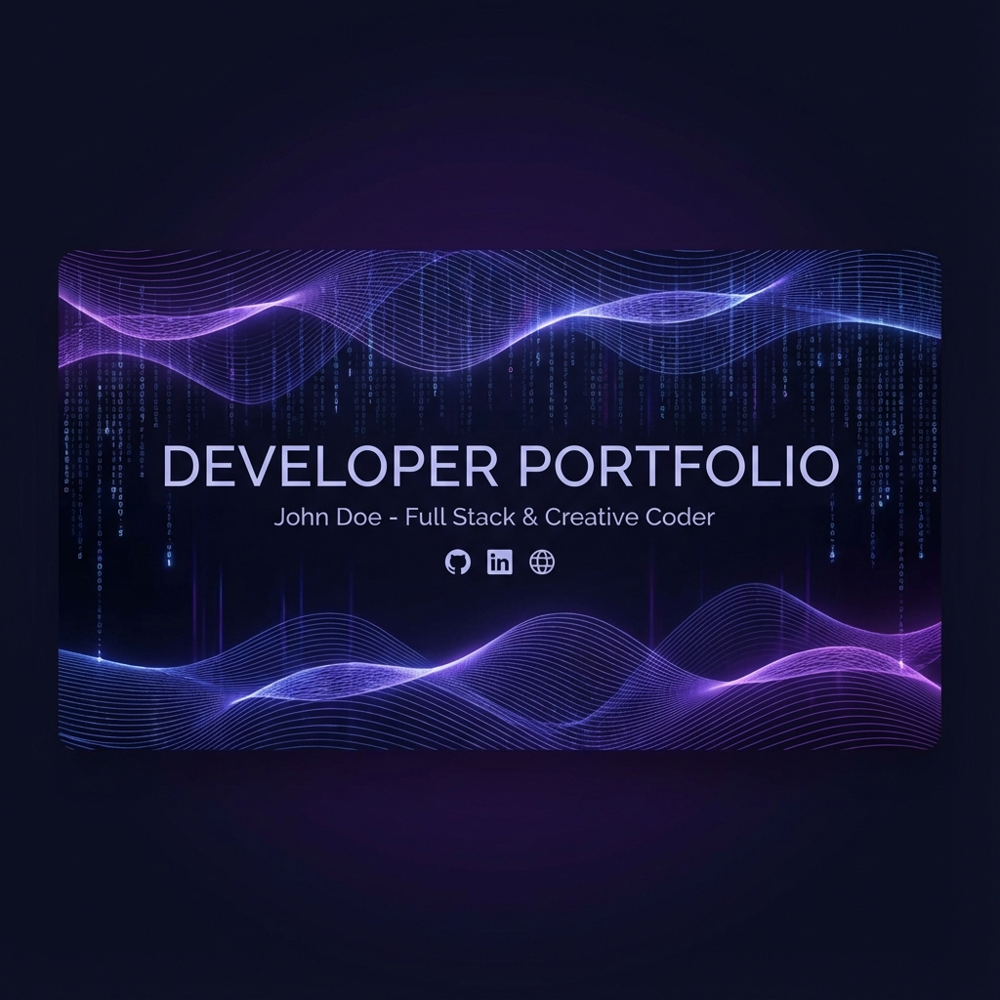

  <h1 style="font-size: 3rem; font-weight: bold; margin-top: 20px;">Harsha Vardhan</h1>
  

    <strong>Software Engineer | Full Stack Specialist | Problem Solver</strong>
  

  
  

    
    
  

  

    
    
  

---

## � Innovating with Code

Welcome to my digital workspace. This repository houses the source code for my personal portfolio—a reflection of my journey as a computer science engineer. 

I don't just write code; I build **systems**. From AI-driven classification engines to comprehensive management platforms, my work focuses on efficiency, scalability, and user-centric design.

## � Featured Engineering

| Project | Tech Stack | Impact |
| :--- | :--- | :--- |
| **[AI Postal Grievances](projects.html)** | `Java` `Spring Boot` `NLP` `Python` | Automated complaint processing, reducing manual categorization time by **40%**. |
| **[Library Engine](projects.html)** | `JSP` `Servlet` `MySQL` `Bootstrap` | Digitized inventory for **1000+ books** with automated fine calculation logic. |
| **[Portfolio V2](index.html)** | `HTML5` `CSS3` `Glassmorphism` | A **100/100 Lighthouse** performance score site with premium design aesthetics. |

## �️ Technical Arsenal

  

 

- **Core**: Deep expertise in **Java** and Object-Oriented Programming.
- **Backend**: Proficient in building RESTful APIs with **Spring Boot**.
- **Frontend**: Creating responsive interfaces with modern **JavaScript** and CSS3.
- **Tools**: Version control with **Git**, containerization concepts, and agile workflows.

## 🌟 Philosophy

> *"The function of good software is to make the complex appear simple."*

This portfolio is built with that ethos. No heavy frameworks where none are needed. Clean code. Semantic structure. Pure performance.

---

  <h3>Let's Build Something Amazing Together</h3>
  
Open for opportunities and collaborations.

  
&copy; 2025 Harsha Vardhan

